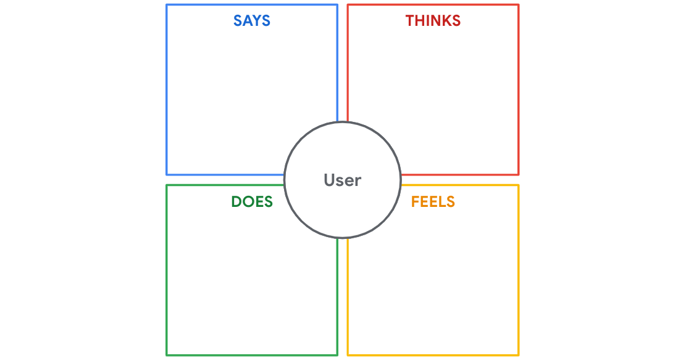
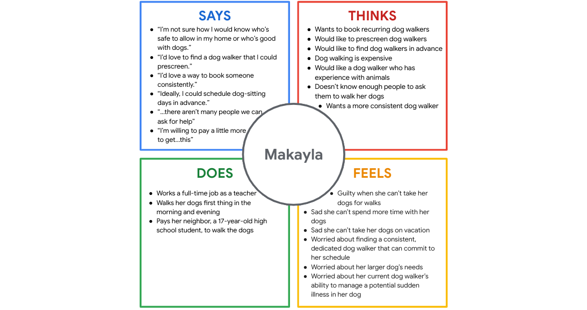

Here’s a concise summary of the text:

---

**Empathy Maps in UX Design**

Empathy maps are tools used by UX designers to understand users' needs, thoughts, feelings, and behaviors. While interviews provide raw insights, empathy maps help organize and summarize this information into an easily digestible format.

**Creating an Empathy Map:**
An empathy map includes four key sections:

* **Says:** Direct quotes from the user.
* **Thinks:** Inferred thoughts and motivations.
* **Does:** Actions the user takes.
* **Feels:** Emotions expressed or implied.

**Example – Makayla:**
Makayla, a busy teacher with two dogs, struggles to find reliable dog walking help. Her concerns include inconsistency, lack of experience in current help, and scheduling challenges. She wants a trustworthy, prescreened, consistent dog walker, even if it costs more.

Empathy map template:

Empathy map Makala:

**Types of Empathy Maps:**

1. **One-user empathy maps** focus on insights from a single user.
2. **Aggregated empathy maps** combine insights from multiple users to identify common patterns and user segments.

Empathy mapping helps UX teams gain deeper insight into users’ needs and design better user-centered solutions.
